## e-커머스 프로젝트 시퀀스 다이어그램
---
---

### 잔액 충전

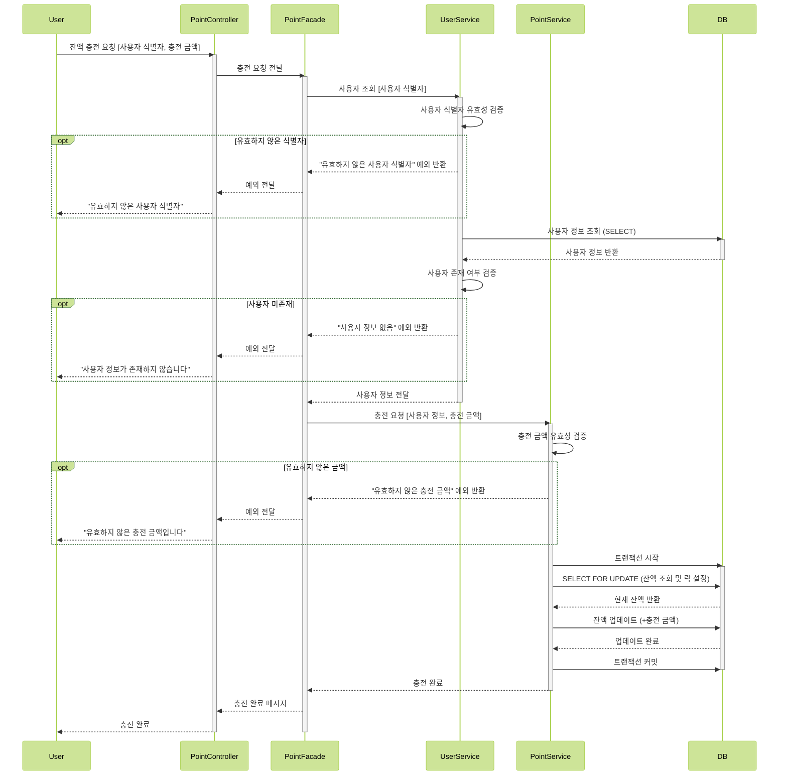
```mermaid
---
config:
  theme: forest
---
sequenceDiagram
    participant User
    participant PointController
    participant PointFacade
    participant UserService
    participant PointService
    participant DB
    User->>PointController: 잔액 충전 요청 [사용자 식별자, 충전 금액]
    activate PointController
    PointController->>PointFacade: 충전 요청 전달
    activate PointFacade
    PointFacade->>UserService: 사용자 조회 [사용자 식별자]
    activate UserService
    UserService->>UserService: 사용자 식별자 유효성 검증
    opt 유효하지 않은 식별자
        UserService-->>PointFacade: "유효하지 않은 사용자 식별자" 예외 반환
        PointFacade-->>PointController: 예외 전달
        PointController-->>User: "유효하지 않은 사용자 식별자"
    end
    UserService->>DB: 사용자 정보 조회 (SELECT)
    activate DB
    DB-->>UserService: 사용자 정보 반환
    deactivate DB
    UserService->>UserService: 사용자 존재 여부 검증
    opt 사용자 미존재
        UserService-->>PointFacade: "사용자 정보 없음" 예외 반환
        PointFacade-->>PointController: 예외 전달
        PointController-->>User: "사용자 정보가 존재하지 않습니다"
    end
    UserService-->>PointFacade: 사용자 정보 전달
    deactivate UserService
    PointFacade->>PointService: 충전 요청 [사용자 정보, 충전 금액]
    activate PointService
    PointService->>PointService: 충전 금액 유효성 검증
    opt 유효하지 않은 금액
        PointService-->>PointFacade: "유효하지 않은 충전 금액" 예외 반환
        PointFacade-->>PointController: 예외 전달
        PointController-->>User: "유효하지 않은 충전 금액입니다"
    end
    PointService->>DB: 트랜잭션 시작
    activate DB
    PointService->>DB: SELECT FOR UPDATE (잔액 조회 및 락 설정)
    DB-->>PointService: 현재 잔액 반환
    PointService->>DB: 잔액 업데이트 (+충전 금액)
    DB-->>PointService: 업데이트 완료
    PointService->>DB: 트랜잭션 커밋
    deactivate DB
    PointService-->>PointFacade: 충전 완료
    deactivate PointService
    PointFacade-->>PointController: 충전 완료 메시지
    PointController-->>User: 충전 완료
    deactivate PointFacade
    deactivate PointController

```
---
### 잔액 조회
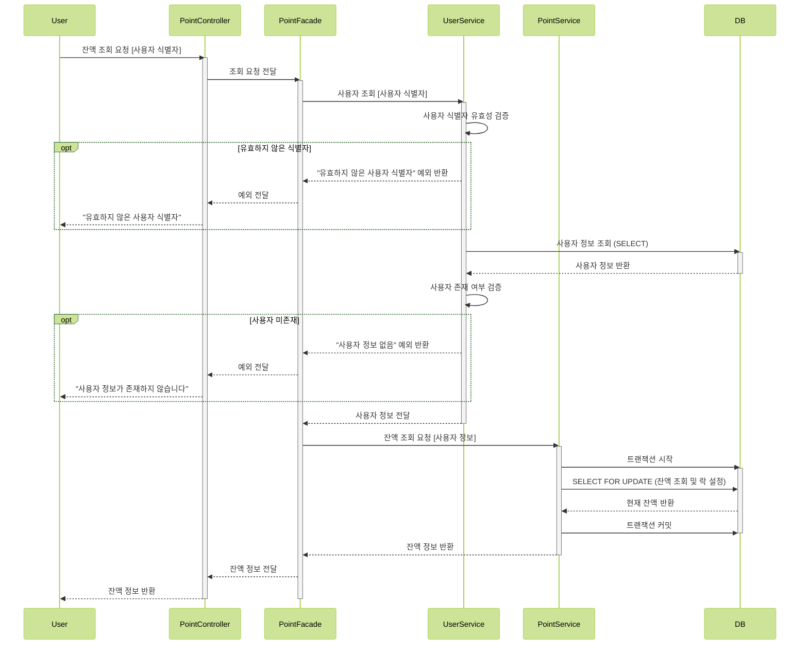
```mermaid
---
config:
  theme: forest
---
sequenceDiagram
    participant User
    participant PointController
    participant PointFacade
    participant UserService
    participant PointService
    participant DB

    User->>PointController: 잔액 조회 요청 [사용자 식별자]
    activate PointController
    PointController->>PointFacade: 조회 요청 전달
    activate PointFacade
    
    %% 사용자 검증
    PointFacade->>UserService: 사용자 조회 [사용자 식별자]
    activate UserService
    
    UserService->>UserService: 사용자 식별자 유효성 검증
    opt 유효하지 않은 식별자
        UserService-->>PointFacade: "유효하지 않은 사용자 식별자" 예외 반환
        PointFacade-->>PointController: 예외 전달
        PointController-->>User: "유효하지 않은 사용자 식별자"
    end
    
    UserService->>DB: 사용자 정보 조회 (SELECT)
    activate DB
    DB-->>UserService: 사용자 정보 반환
    deactivate DB
    
    UserService->>UserService: 사용자 존재 여부 검증
    opt 사용자 미존재
        UserService-->>PointFacade: "사용자 정보 없음" 예외 반환
        PointFacade-->>PointController: 예외 전달
        PointController-->>User: "사용자 정보가 존재하지 않습니다"
    end
    
    UserService-->>PointFacade: 사용자 정보 전달
    deactivate UserService

    %% 포인트 조회 처리
    PointFacade->>PointService: 잔액 조회 요청 [사용자 정보]
    activate PointService
    
    %% 트랜잭션 시작
    PointService->>DB: 트랜잭션 시작
    activate DB
    
    PointService->>DB: SELECT FOR UPDATE (잔액 조회 및 락 설정)
    DB-->>PointService: 현재 잔액 반환
    
    PointService->>DB: 트랜잭션 커밋
    deactivate DB
    
    PointService-->>PointFacade: 잔액 정보 반환
    deactivate PointService
    
    PointFacade-->>PointController: 잔액 정보 전달
    PointController-->>User: 잔액 정보 반환
    deactivate PointFacade
    deactivate PointController
```
---
### 잔액 충전 및 조회 동시성 처리 확인
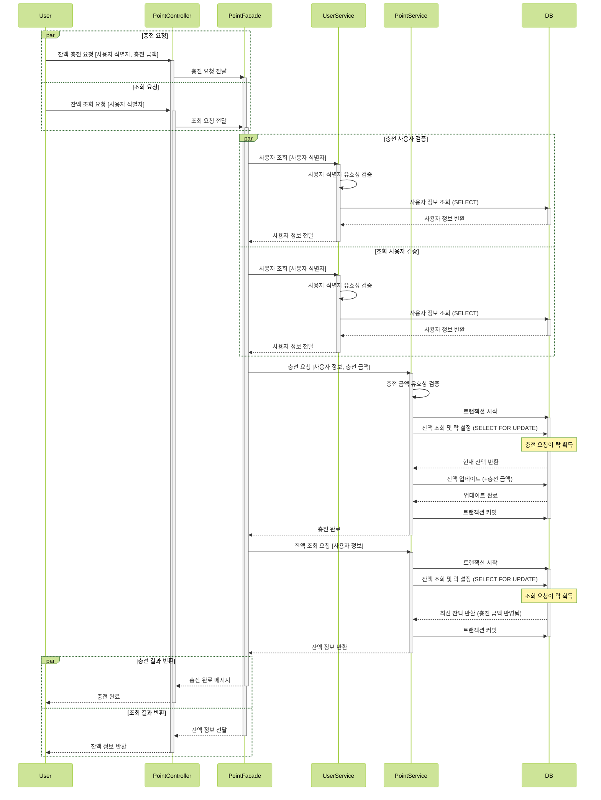
```mermaid
---
config:
  theme: forest
---
sequenceDiagram
    participant User
    participant PointController
    participant PointFacade
    participant UserService
    participant PointService
    participant DB

    %% 동시 요청 시작
    par 충전 요청
        User->>PointController: 잔액 충전 요청 [사용자 식별자, 충전 금액]
        activate PointController
        PointController->>PointFacade: 충전 요청 전달
        activate PointFacade
    and 조회 요청
        User->>PointController: 잔액 조회 요청 [사용자 식별자]
        activate PointController
        PointController->>PointFacade: 조회 요청 전달
        activate PointFacade
    end

    %% 병렬 사용자 검증
    par 충전 사용자 검증
        PointFacade->>UserService: 사용자 조회 [사용자 식별자]
        activate UserService
        UserService->>UserService: 사용자 식별자 유효성 검증
        UserService->>DB: 사용자 정보 조회 (SELECT)
        activate DB
        DB-->>UserService: 사용자 정보 반환
        deactivate DB
        UserService-->>PointFacade: 사용자 정보 전달
        deactivate UserService
    and 조회 사용자 검증
        PointFacade->>UserService: 사용자 조회 [사용자 식별자]
        activate UserService
        UserService->>UserService: 사용자 식별자 유효성 검증
        UserService->>DB: 사용자 정보 조회 (SELECT)
        activate DB
        DB-->>UserService: 사용자 정보 반환
        deactivate DB
        UserService-->>PointFacade: 사용자 정보 전달
        deactivate UserService
    end

    %% 충전 처리
    PointFacade->>PointService: 충전 요청 [사용자 정보, 충전 금액]
    activate PointService
    
    PointService->>PointService: 충전 금액 유효성 검증
    
    %% 충전 트랜잭션 시작
    PointService->>DB: 트랜잭션 시작
    activate DB
    
    PointService->>DB: 잔액 조회 및 락 설정 (SELECT FOR UPDATE)
    Note over DB: 충전 요청이 락 획득
    DB-->>PointService: 현재 잔액 반환
    
    PointService->>DB: 잔액 업데이트 (+충전 금액)
    DB-->>PointService: 업데이트 완료
    
    PointService->>DB: 트랜잭션 커밋
    deactivate DB
    
    PointService-->>PointFacade: 충전 완료
    deactivate PointService

    %% 조회 처리 (충전 완료 후 락 획득)
    PointFacade->>PointService: 잔액 조회 요청 [사용자 정보]
    activate PointService
    
    %% 조회 트랜잭션 시작
    PointService->>DB: 트랜잭션 시작
    activate DB
    
    PointService->>DB: 잔액 조회 및 락 설정 (SELECT FOR UPDATE)
    Note over DB: 조회 요청이 락 획득
    DB-->>PointService: 최신 잔액 반환 (충전 금액 반영됨)
    
    PointService->>DB: 트랜잭션 커밋
    deactivate DB
    
    PointService-->>PointFacade: 잔액 정보 반환
    deactivate PointService

    %% 결과 반환
    par 충전 결과 반환
        PointFacade-->>PointController: 충전 완료 메시지
        deactivate PointFacade
        PointController-->>User: 충전 완료
        deactivate PointController
    and 조회 결과 반환
        PointFacade-->>PointController: 잔액 정보 전달
        deactivate PointFacade
        PointController-->>User: 잔액 정보 반환
        deactivate PointController
    end
```
---
### 상품 전체 목록 조회
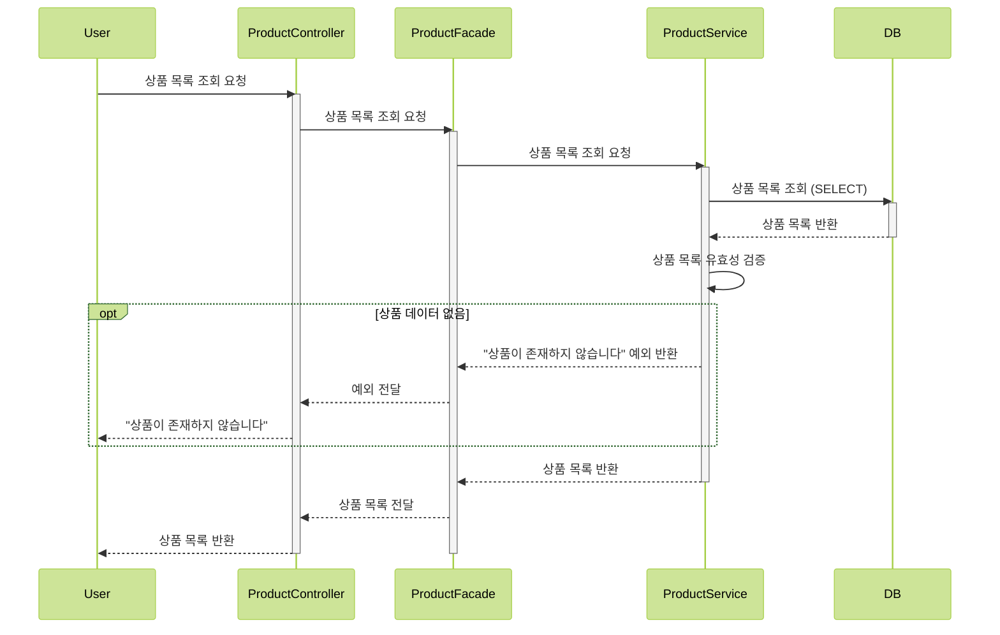
```mermaid
---
config:
  theme: forest
---
sequenceDiagram
    participant User
    participant ProductController
    participant ProductFacade
    participant ProductService
    participant DB

    User->>ProductController: 상품 목록 조회 요청
    activate ProductController
    ProductController->>ProductFacade: 상품 목록 조회 요청
    activate ProductFacade
    
    ProductFacade->>ProductService: 상품 목록 조회 요청
    activate ProductService
    
    ProductService->>DB: 상품 목록 조회 (SELECT)
    activate DB
    DB-->>ProductService: 상품 목록 반환
    deactivate DB
    
    ProductService->>ProductService: 상품 목록 유효성 검증
    opt 상품 데이터 없음
        ProductService-->>ProductFacade: "상품이 존재하지 않습니다" 예외 반환
        ProductFacade-->>ProductController: 예외 전달
        ProductController-->>User: "상품이 존재하지 않습니다"
    end
    
    ProductService-->>ProductFacade: 상품 목록 반환
    deactivate ProductService
    
    ProductFacade-->>ProductController: 상품 목록 전달
    ProductController-->>User: 상품 목록 반환
    deactivate ProductFacade
    deactivate ProductController
```
---
### 상품 상세 조회
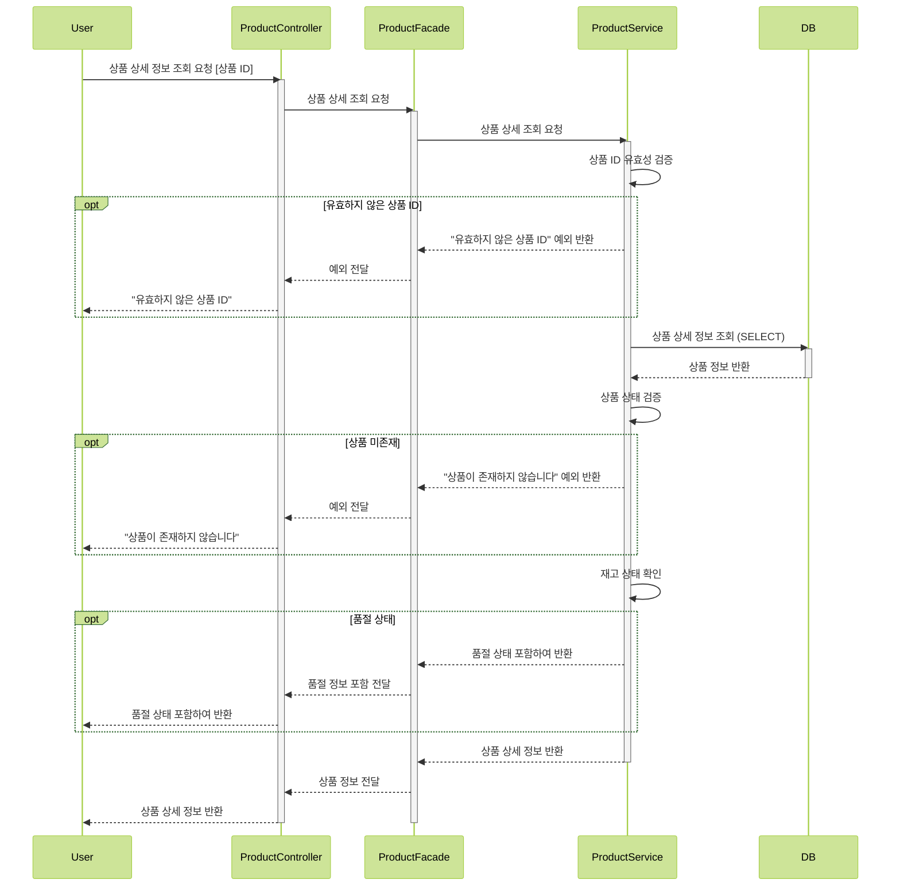
```mermaid
---
config:
  theme: forest
---
sequenceDiagram
    participant User
    participant ProductController
    participant ProductFacade
    participant ProductService
    participant DB

    User->>ProductController: 상품 상세 정보 조회 요청 [상품 ID]
    activate ProductController
    ProductController->>ProductFacade: 상품 상세 조회 요청
    activate ProductFacade
    
    ProductFacade->>ProductService: 상품 상세 조회 요청
    activate ProductService
    
    ProductService->>ProductService: 상품 ID 유효성 검증
    opt 유효하지 않은 상품 ID
        ProductService-->>ProductFacade: "유효하지 않은 상품 ID" 예외 반환
        ProductFacade-->>ProductController: 예외 전달
        ProductController-->>User: "유효하지 않은 상품 ID"
    end
    
    ProductService->>DB: 상품 상세 정보 조회 (SELECT)
    activate DB
    DB-->>ProductService: 상품 정보 반환
    deactivate DB
    
    ProductService->>ProductService: 상품 상태 검증
    opt 상품 미존재
        ProductService-->>ProductFacade: "상품이 존재하지 않습니다" 예외 반환
        ProductFacade-->>ProductController: 예외 전달
        ProductController-->>User: "상품이 존재하지 않습니다"
    end
    
    ProductService->>ProductService: 재고 상태 확인
    opt 품절 상태
        ProductService-->>ProductFacade: 품절 상태 포함하여 반환
        ProductFacade-->>ProductController: 품절 정보 포함 전달
        ProductController-->>User: 품절 상태 포함하여 반환
    end
    
    ProductService-->>ProductFacade: 상품 상세 정보 반환
    deactivate ProductService
    
    ProductFacade-->>ProductController: 상품 정보 전달
    ProductController-->>User: 상품 상세 정보 반환
    deactivate ProductFacade
    deactivate ProductController
```
---
### 상품 조회와 결제 요청이 동시에 진행될 때, 결제 완료 후 감소된 재고 조회 (동시성 조회) 
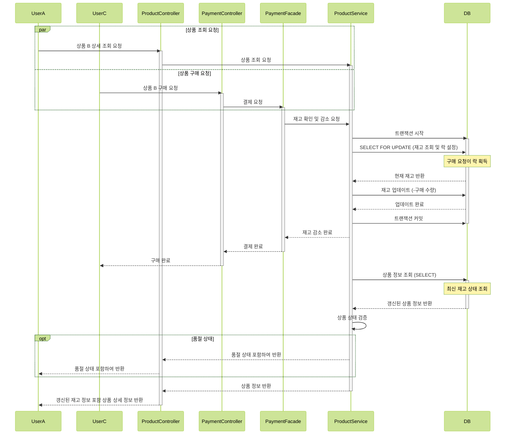
```mermaid
---
config:
  theme: forest
---
sequenceDiagram
    participant UserA
    participant UserC
    participant ProductController
    participant PaymentController
    participant PaymentFacade
    participant ProductService
    participant DB

    %% 동시 요청 시작
    par 상품 조회 요청
        UserA->>ProductController: 상품 B 상세 조회 요청
        activate ProductController
        ProductController->>ProductService: 상품 조회 요청
        activate ProductService
    and 상품 구매 요청
        UserC->>PaymentController: 상품 B 구매 요청
        activate PaymentController
        PaymentController->>PaymentFacade: 결제 요청
        activate PaymentFacade
    end

    %% 구매 처리 (먼저 락 획득)
    PaymentFacade->>ProductService: 재고 확인 및 감소 요청
    
    %% 구매 트랜잭션 시작
    ProductService->>DB: 트랜잭션 시작
    activate DB
    
    ProductService->>DB: SELECT FOR UPDATE (재고 조회 및 락 설정)
    Note over DB: 구매 요청이 락 획득
    DB-->>ProductService: 현재 재고 반환
    
    ProductService->>DB: 재고 업데이트 (-구매 수량)
    DB-->>ProductService: 업데이트 완료
    
    ProductService->>DB: 트랜잭션 커밋
    deactivate DB
    
    ProductService-->>PaymentFacade: 재고 감소 완료
    
    PaymentFacade-->>PaymentController: 결제 완료
    deactivate PaymentFacade
    PaymentController-->>UserC: 구매 완료
    deactivate PaymentController

    %% 조회 처리 (구매 완료 후)
    ProductService->>DB: 상품 정보 조회 (SELECT)
    activate DB
    Note over DB: 최신 재고 상태 조회
    DB-->>ProductService: 갱신된 상품 정보 반환
    deactivate DB
    
    ProductService->>ProductService: 상품 상태 검증
    opt 품절 상태
        ProductService-->>ProductController: 품절 상태 포함하여 반환
        ProductController-->>UserA: 품절 상태 포함하여 반환
    end
    
    ProductService-->>ProductController: 상품 정보 반환
    deactivate ProductService
    
    ProductController-->>UserA: 갱신된 재고 정보 포함 상품 상세 정보 반환
    deactivate ProductController
```
---
### 쿠폰 발급
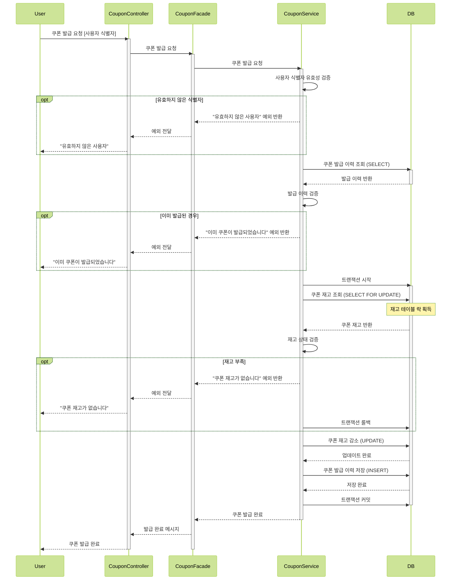
```mermaid
---
config:
  theme: forest
---
sequenceDiagram
    participant User
    participant CouponController
    participant CouponFacade
    participant CouponService
    participant DB

    User->>CouponController: 쿠폰 발급 요청 [사용자 식별자]
    activate CouponController
    CouponController->>CouponFacade: 쿠폰 발급 요청
    activate CouponFacade
    
    CouponFacade->>CouponService: 쿠폰 발급 요청
    activate CouponService
    
    %% 도메인 검증
    CouponService->>CouponService: 사용자 식별자 유효성 검증
    opt 유효하지 않은 식별자
        CouponService-->>CouponFacade: "유효하지 않은 사용자" 예외 반환
        CouponFacade-->>CouponController: 예외 전달
        CouponController-->>User: "유효하지 않은 사용자"
    end
    
    %% 발급 이력 확인
    CouponService->>DB: 쿠폰 발급 이력 조회 (SELECT)
    activate DB
    DB-->>CouponService: 발급 이력 반환
    deactivate DB
    
    CouponService->>CouponService: 발급 이력 검증
    opt 이미 발급된 경우
        CouponService-->>CouponFacade: "이미 쿠폰이 발급되었습니다" 예외 반환
        CouponFacade-->>CouponController: 예외 전달
        CouponController-->>User: "이미 쿠폰이 발급되었습니다"
    end
    
    %% 트랜잭션 시작 (재고 확인 및 발급)
    CouponService->>DB: 트랜잭션 시작
    activate DB
    
    CouponService->>DB: 쿠폰 재고 조회 (SELECT FOR UPDATE)
    Note over DB: 재고 테이블 락 획득
    DB-->>CouponService: 쿠폰 재고 반환
    
    CouponService->>CouponService: 재고 상태 검증
    opt 재고 부족
        CouponService-->>CouponFacade: "쿠폰 재고가 없습니다" 예외 반환
        CouponFacade-->>CouponController: 예외 전달
        CouponController-->>User: "쿠폰 재고가 없습니다"
        CouponService->>DB: 트랜잭션 롤백
    end
    
    CouponService->>DB: 쿠폰 재고 감소 (UPDATE)
    DB-->>CouponService: 업데이트 완료
    
    CouponService->>DB: 쿠폰 발급 이력 저장 (INSERT)
    DB-->>CouponService: 저장 완료
    
    CouponService->>DB: 트랜잭션 커밋
    deactivate DB
    
    CouponService-->>CouponFacade: 쿠폰 발급 완료
    deactivate CouponService
    
    CouponFacade-->>CouponController: 발급 완료 메시지
    CouponController-->>User: 쿠폰 발급 완료
    deactivate CouponFacade
    deactivate CouponController
```
---
### 쿠폰 발급 동시성 확인
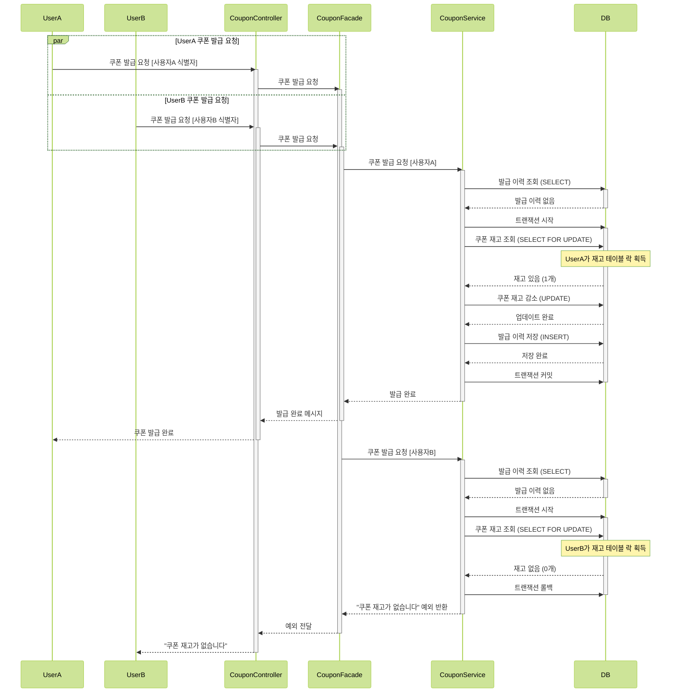
```mermaid
---
config:
  theme: forest
---
sequenceDiagram
    participant UserA
    participant UserB
    participant CouponController
    participant CouponFacade
    participant CouponService
    participant DB

    %% 동시 요청 시작
    par UserA 쿠폰 발급 요청
        UserA->>CouponController: 쿠폰 발급 요청 [사용자A 식별자]
        activate CouponController
        CouponController->>CouponFacade: 쿠폰 발급 요청
        activate CouponFacade
    and UserB 쿠폰 발급 요청
        UserB->>CouponController: 쿠폰 발급 요청 [사용자B 식별자]
        activate CouponController
        CouponController->>CouponFacade: 쿠폰 발급 요청
        activate CouponFacade
    end

    %% UserA 처리 (먼저 락 획득)
    CouponFacade->>CouponService: 쿠폰 발급 요청 [사용자A]
    activate CouponService
    
    %% 발급 이력 확인
    CouponService->>DB: 발급 이력 조회 (SELECT)
    activate DB
    DB-->>CouponService: 발급 이력 없음
    deactivate DB
    
    %% UserA 트랜잭션 시작
    CouponService->>DB: 트랜잭션 시작
    activate DB
    
    CouponService->>DB: 쿠폰 재고 조회 (SELECT FOR UPDATE)
    Note over DB: UserA가 재고 테이블 락 획득
    DB-->>CouponService: 재고 있음 (1개)
    
    CouponService->>DB: 쿠폰 재고 감소 (UPDATE)
    DB-->>CouponService: 업데이트 완료
    
    CouponService->>DB: 발급 이력 저장 (INSERT)
    DB-->>CouponService: 저장 완료
    
    CouponService->>DB: 트랜잭션 커밋
    deactivate DB
    
    CouponService-->>CouponFacade: 발급 완료
    deactivate CouponService
    
    CouponFacade-->>CouponController: 발급 완료 메시지
    deactivate CouponFacade
    CouponController-->>UserA: 쿠폰 발급 완료
    deactivate CouponController

    %% UserB 처리 (UserA 트랜잭션 완료 후)
    CouponFacade->>CouponService: 쿠폰 발급 요청 [사용자B]
    activate CouponService
    
    %% 발급 이력 확인
    CouponService->>DB: 발급 이력 조회 (SELECT)
    activate DB
    DB-->>CouponService: 발급 이력 없음
    deactivate DB
    
    %% UserB 트랜잭션 시작
    CouponService->>DB: 트랜잭션 시작
    activate DB
    
    CouponService->>DB: 쿠폰 재고 조회 (SELECT FOR UPDATE)
    Note over DB: UserB가 재고 테이블 락 획득
    DB-->>CouponService: 재고 없음 (0개)
    
    CouponService->>DB: 트랜잭션 롤백
    deactivate DB
    
    CouponService-->>CouponFacade: "쿠폰 재고가 없습니다" 예외 반환
    deactivate CouponService
    
    CouponFacade-->>CouponController: 예외 전달
    deactivate CouponFacade
    CouponController-->>UserB: "쿠폰 재고가 없습니다"
    deactivate CouponController
```
---
### 쿠폰 발급 이력 조회
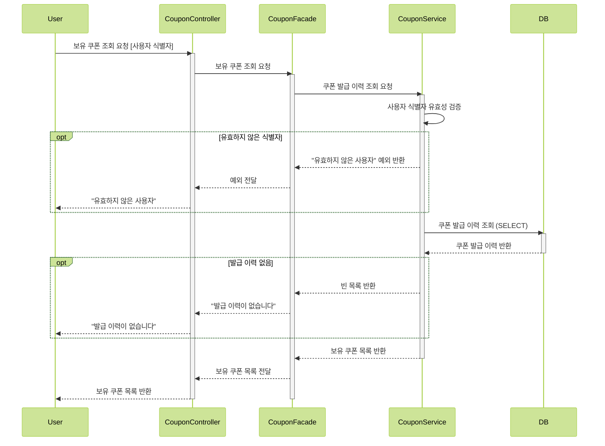
```mermaid
---
config:
  theme: forest
---
sequenceDiagram
    participant User
    participant CouponController
    participant CouponFacade
    participant CouponService
    participant DB

    User->>CouponController: 보유 쿠폰 조회 요청 [사용자 식별자]
    activate CouponController
    CouponController->>CouponFacade: 보유 쿠폰 조회 요청
    activate CouponFacade
    
    CouponFacade->>CouponService: 쿠폰 발급 이력 조회 요청
    activate CouponService
    
    CouponService->>CouponService: 사용자 식별자 유효성 검증
    opt 유효하지 않은 식별자
        CouponService-->>CouponFacade: "유효하지 않은 사용자" 예외 반환
        CouponFacade-->>CouponController: 예외 전달
        CouponController-->>User: "유효하지 않은 사용자"
    end
    
    CouponService->>DB: 쿠폰 발급 이력 조회 (SELECT)
    activate DB
    DB-->>CouponService: 쿠폰 발급 이력 반환
    deactivate DB
    
    opt 발급 이력 없음
        CouponService-->>CouponFacade: 빈 목록 반환
        CouponFacade-->>CouponController: "발급 이력이 없습니다"
        CouponController-->>User: "발급 이력이 없습니다"
    end
    
    CouponService-->>CouponFacade: 보유 쿠폰 목록 반환
    deactivate CouponService
    
    CouponFacade-->>CouponController: 보유 쿠폰 목록 전달
    CouponController-->>User: 보유 쿠폰 목록 반환
    deactivate CouponFacade
    deactivate CouponController
```
---
### 주문
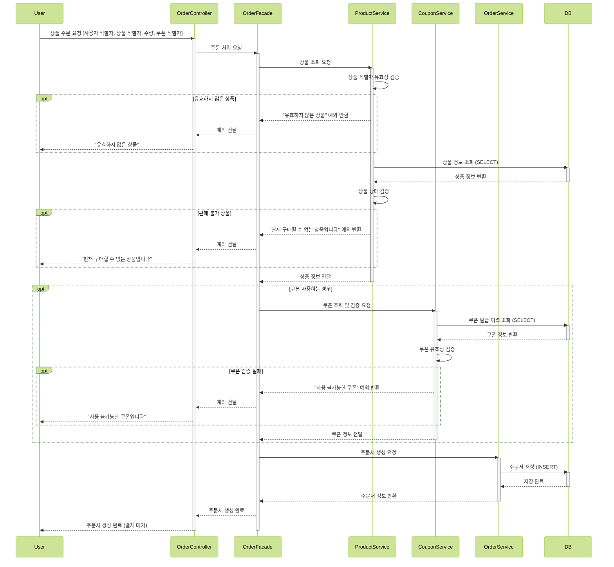
```mermaid
---
config:
  theme: forest
---
sequenceDiagram
    participant User
    participant OrderController
    participant OrderFacade
    participant ProductService
    participant CouponService
    participant OrderService
    participant DB

    User->>OrderController: 상품 주문 요청 [사용자 식별자, 상품 식별자, 수량, 쿠폰 식별자]
    activate OrderController
    OrderController->>OrderFacade: 주문 처리 요청
    activate OrderFacade
    
    %% 상품 유효성 검증
    OrderFacade->>ProductService: 상품 조회 요청
    activate ProductService
    
    ProductService->>ProductService: 상품 식별자 유효성 검증
    opt 유효하지 않은 상품
        ProductService-->>OrderFacade: "유효하지 않은 상품" 예외 반환
        OrderFacade-->>OrderController: 예외 전달
        OrderController-->>User: "유효하지 않은 상품"
    end
    
    ProductService->>DB: 상품 정보 조회 (SELECT)
    activate DB
    DB-->>ProductService: 상품 정보 반환
    deactivate DB
    
    ProductService->>ProductService: 상품 상태 검증
    opt 판매 불가 상품
        ProductService-->>OrderFacade: "현재 구매할 수 없는 상품입니다" 예외 반환
        OrderFacade-->>OrderController: 예외 전달
        OrderController-->>User: "현재 구매할 수 없는 상품입니다"
    end
    
    ProductService-->>OrderFacade: 상품 정보 전달
    deactivate ProductService

    %% 쿠폰 검증
    opt 쿠폰 사용하는 경우
        OrderFacade->>CouponService: 쿠폰 조회 및 검증 요청
        activate CouponService
        
        CouponService->>DB: 쿠폰 발급 이력 조회 (SELECT)
        activate DB
        DB-->>CouponService: 쿠폰 정보 반환
        deactivate DB
        
        CouponService->>CouponService: 쿠폰 유효성 검증
        opt 쿠폰 검증 실패
            CouponService-->>OrderFacade: "사용 불가능한 쿠폰" 예외 반환
            OrderFacade-->>OrderController: 예외 전달
            OrderController-->>User: "사용 불가능한 쿠폰입니다"
        end
        
        CouponService-->>OrderFacade: 쿠폰 정보 전달
        deactivate CouponService
    end

    %% 주문서 생성
    OrderFacade->>OrderService: 주문서 생성 요청
    activate OrderService
    
    OrderService->>DB: 주문서 저장 (INSERT)
    activate DB
    DB-->>OrderService: 저장 완료
    deactivate DB
    
    OrderService-->>OrderFacade: 주문서 정보 반환
    deactivate OrderService
    
    OrderFacade-->>OrderController: 주문서 생성 완료
    OrderController-->>User: 주문서 생성 완료 (결제 대기)
    deactivate OrderFacade
    deactivate OrderController
```
---
### 결제
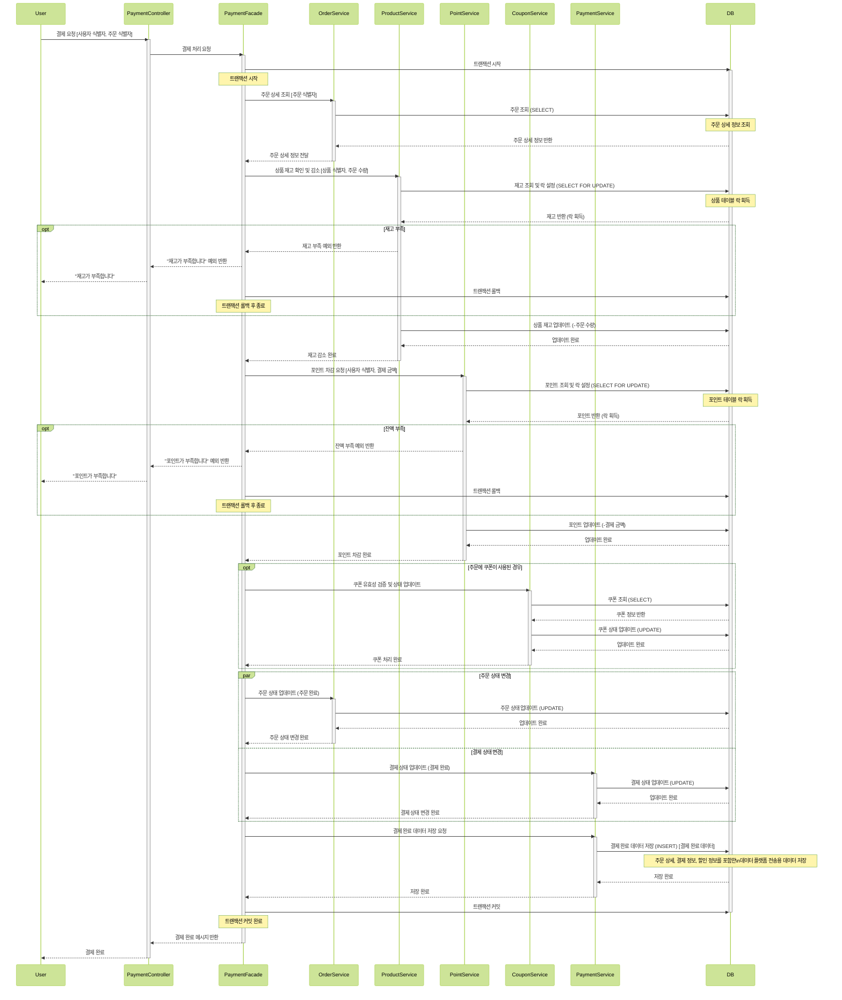
```mermaid
---
config:
  theme: forest
---
sequenceDiagram
    participant User
    participant PaymentController
    participant PaymentFacade
    participant OrderService
    participant ProductService
    participant PointService
    participant CouponService
    participant PaymentService
    participant DB

    User->>PaymentController: 결제 요청 [사용자 식별자, 주문 식별자]
    activate PaymentController
    PaymentController->>PaymentFacade: 결제 처리 요청
    activate PaymentFacade
    
    %% 트랜잭션 시작
    PaymentFacade->>DB: 트랜잭션 시작
    activate DB
    Note over PaymentFacade: 트랜잭션 시작
    
    %% 주문 상세 조회
    PaymentFacade->>OrderService: 주문 상세 조회 [주문 식별자]
    activate OrderService
    OrderService->>DB: 주문 조회 (SELECT)
    Note over DB: 주문 상세 정보 조회
    DB-->>OrderService: 주문 상세 정보 반환
    OrderService-->>PaymentFacade: 주문 상세 정보 전달
    deactivate OrderService

    %% 재고 확인 및 감소 (비관적 락)
    PaymentFacade->>ProductService: 상품 재고 확인 및 감소 [상품 식별자, 주문 수량]
    activate ProductService
    ProductService->>DB: 재고 조회 및 락 설정 (SELECT FOR UPDATE)
    Note over DB: 상품 테이블 락 획득
    DB-->>ProductService: 재고 반환 (락 획득)
    opt 재고 부족
        ProductService-->>PaymentFacade: 재고 부족 예외 반환
        PaymentFacade-->>PaymentController: "재고가 부족합니다" 예외 반환
        PaymentController-->>User: "재고가 부족합니다"
        PaymentFacade->>DB: 트랜잭션 롤백
        Note over PaymentFacade: 트랜잭션 롤백 후 종료
    end
    ProductService->>DB: 상품 재고 업데이트 (-주문 수량)
    DB-->>ProductService: 업데이트 완료
    ProductService-->>PaymentFacade: 재고 감소 완료
    deactivate ProductService
    
    %% 포인트 차감 (비관적 락)
    PaymentFacade->>PointService: 포인트 차감 요청 [사용자 식별자, 결제 금액]
    activate PointService
    PointService->>DB: 포인트 조회 및 락 설정 (SELECT FOR UPDATE)
    Note over DB: 포인트 테이블 락 획득
    DB-->>PointService: 포인트 반환 (락 획득)
    opt 잔액 부족
        PointService-->>PaymentFacade: 잔액 부족 예외 반환
        PaymentFacade-->>PaymentController: "포인트가 부족합니다" 예외 반환
        PaymentController-->>User: "포인트가 부족합니다"
        PaymentFacade->>DB: 트랜잭션 롤백
        Note over PaymentFacade: 트랜잭션 롤백 후 종료
    end
    PointService->>DB: 포인트 업데이트 (-결제 금액)
    DB-->>PointService: 업데이트 완료
    PointService-->>PaymentFacade: 포인트 차감 완료
    deactivate PointService
    
    %% 쿠폰 검증 및 상태 업데이트
    opt 주문에 쿠폰이 사용된 경우
        PaymentFacade->>CouponService: 쿠폰 유효성 검증 및 상태 업데이트
        activate CouponService
        CouponService->>DB: 쿠폰 조회 (SELECT)
        DB-->>CouponService: 쿠폰 정보 반환
        CouponService->>DB: 쿠폰 상태 업데이트 (UPDATE)
        DB-->>CouponService: 업데이트 완료
        CouponService-->>PaymentFacade: 쿠폰 처리 완료
        deactivate CouponService
    end
    
    %% 주문/결제 상태 업데이트
    par 주문 상태 변경
        PaymentFacade->>OrderService: 주문 상태 업데이트 (주문 완료)
        activate OrderService
        OrderService->>DB: 주문 상태 업데이트 (UPDATE)
        DB-->>OrderService: 업데이트 완료
        OrderService-->>PaymentFacade: 주문 상태 변경 완료
        deactivate OrderService
    and 결제 상태 변경
        PaymentFacade->>PaymentService: 결제 상태 업데이트 (결제 완료)
        activate PaymentService
        PaymentService->>DB: 결제 상태 업데이트 (UPDATE)
        DB-->>PaymentService: 업데이트 완료
        PaymentService-->>PaymentFacade: 결제 상태 변경 완료
        deactivate PaymentService
    end
    %% 데이터 플랫폼 전송용 데이터 저장
    PaymentFacade->>PaymentService: 결제 완료 데이터 저장 요청
    activate PaymentService
    PaymentService->>DB: 결제 완료 데이터 저장 (INSERT) [결제 완료 데이터]
    Note over DB: 주문 상세, 결제 정보, 할인 정보를 포함한\n데이터 플랫폼 전송용 데이터 저장
    DB-->>PaymentService: 저장 완료
    PaymentService-->>PaymentFacade: 저장 완료
    deactivate PaymentService
    
    %% 트랜잭션 커밋
    PaymentFacade->>DB: 트랜잭션 커밋
    deactivate DB
    Note over PaymentFacade: 트랜잭션 커밋 완료
    PaymentFacade-->>PaymentController: 결제 완료 메시지 반환
    deactivate PaymentFacade
    PaymentController-->>User: 결제 완료
    deactivate PaymentController
```
---
### 결제 동시성 처리 확인
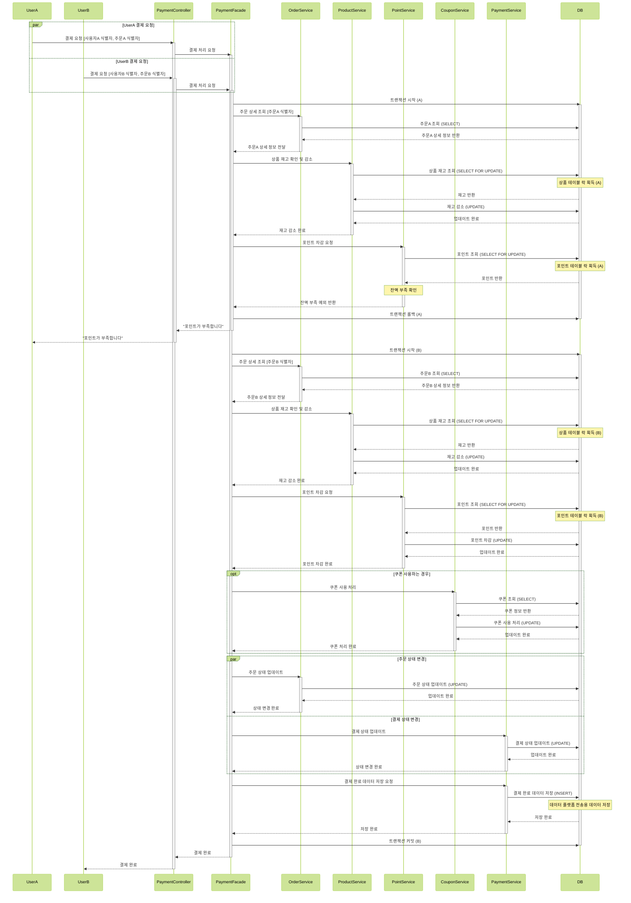
```mermaid
---
config:
  theme: forest
---
sequenceDiagram
    participant UserA
    participant UserB
    participant PaymentController
    participant PaymentFacade
    participant OrderService
    participant ProductService
    participant PointService
    participant CouponService
    participant PaymentService
    participant DB

    %% 동시 요청 시작
    par UserA 결제 요청
        UserA->>PaymentController: 결제 요청 [사용자A 식별자, 주문A 식별자]
        activate PaymentController
        PaymentController->>PaymentFacade: 결제 처리 요청
        activate PaymentFacade
    and UserB 결제 요청
        UserB->>PaymentController: 결제 요청 [사용자B 식별자, 주문B 식별자]
        activate PaymentController
        PaymentController->>PaymentFacade: 결제 처리 요청
        activate PaymentFacade
    end

    %% UserA 트랜잭션 시작
    PaymentFacade->>DB: 트랜잭션 시작 (A)
    activate DB
    
    %% UserA 주문 조회
    PaymentFacade->>OrderService: 주문 상세 조회 [주문A 식별자]
    activate OrderService
    OrderService->>DB: 주문A 조회 (SELECT)
    DB-->>OrderService: 주문A 상세 정보 반환
    OrderService-->>PaymentFacade: 주문A 상세 정보 전달
    deactivate OrderService

    %% UserA 재고 확인 및 감소
    PaymentFacade->>ProductService: 상품 재고 확인 및 감소
    activate ProductService
    ProductService->>DB: 상품 재고 조회 (SELECT FOR UPDATE)
    Note over DB: 상품 테이블 락 획득 (A)
    DB-->>ProductService: 재고 반환
    ProductService->>DB: 재고 감소 (UPDATE)
    DB-->>ProductService: 업데이트 완료
    ProductService-->>PaymentFacade: 재고 감소 완료
    deactivate ProductService

    %% UserA 포인트 차감
    PaymentFacade->>PointService: 포인트 차감 요청
    activate PointService
    PointService->>DB: 포인트 조회 (SELECT FOR UPDATE)
    Note over DB: 포인트 테이블 락 획득 (A)
    DB-->>PointService: 포인트 반환
    Note over PointService: 잔액 부족 확인
    PointService-->>PaymentFacade: 잔액 부족 예외 반환
    deactivate PointService

    %% UserA 트랜잭션 롤백
    PaymentFacade->>DB: 트랜잭션 롤백 (A)
    deactivate DB
    PaymentFacade-->>PaymentController: "포인트가 부족합니다"
    deactivate PaymentFacade
    PaymentController-->>UserA: "포인트가 부족합니다"
    deactivate PaymentController

    %% UserB 트랜잭션 시작
    PaymentFacade->>DB: 트랜잭션 시작 (B)
    activate DB
    
    %% UserB 주문 조회
    PaymentFacade->>OrderService: 주문 상세 조회 [주문B 식별자]
    activate OrderService
    OrderService->>DB: 주문B 조회 (SELECT)
    DB-->>OrderService: 주문B 상세 정보 반환
    OrderService-->>PaymentFacade: 주문B 상세 정보 전달
    deactivate OrderService

    %% UserB 재고 확인 및 감소
    PaymentFacade->>ProductService: 상품 재고 확인 및 감소
    activate ProductService
    ProductService->>DB: 상품 재고 조회 (SELECT FOR UPDATE)
    Note over DB: 상품 테이블 락 획득 (B)
    DB-->>ProductService: 재고 반환
    ProductService->>DB: 재고 감소 (UPDATE)
    DB-->>ProductService: 업데이트 완료
    ProductService-->>PaymentFacade: 재고 감소 완료
    deactivate ProductService

    %% UserB 포인트 차감
    PaymentFacade->>PointService: 포인트 차감 요청
    activate PointService
    PointService->>DB: 포인트 조회 (SELECT FOR UPDATE)
    Note over DB: 포인트 테이블 락 획득 (B)
    DB-->>PointService: 포인트 반환
    PointService->>DB: 포인트 차감 (UPDATE)
    DB-->>PointService: 업데이트 완료
    PointService-->>PaymentFacade: 포인트 차감 완료
    deactivate PointService

    %% UserB 쿠폰 처리
    opt 쿠폰 사용하는 경우
        PaymentFacade->>CouponService: 쿠폰 사용 처리
        activate CouponService
        CouponService->>DB: 쿠폰 조회 (SELECT)
        DB-->>CouponService: 쿠폰 정보 반환
        CouponService->>DB: 쿠폰 사용 처리 (UPDATE)
        DB-->>CouponService: 업데이트 완료
        CouponService-->>PaymentFacade: 쿠폰 처리 완료
        deactivate CouponService
    end

    %% UserB 주문/결제 상태 업데이트
    par 주문 상태 변경
        PaymentFacade->>OrderService: 주문 상태 업데이트
        activate OrderService
        OrderService->>DB: 주문 상태 업데이트 (UPDATE)
        DB-->>OrderService: 업데이트 완료
        OrderService-->>PaymentFacade: 상태 변경 완료
        deactivate OrderService
    and 결제 상태 변경
        PaymentFacade->>PaymentService: 결제 상태 업데이트
        activate PaymentService
        PaymentService->>DB: 결제 상태 업데이트 (UPDATE)
        DB-->>PaymentService: 업데이트 완료
        PaymentService-->>PaymentFacade: 상태 변경 완료
        deactivate PaymentService
    end

    %% 데이터 플랫폼 전송용 데이터 저장
    PaymentFacade->>PaymentService: 결제 완료 데이터 저장 요청
    activate PaymentService
    PaymentService->>DB: 결제 완료 데이터 저장 (INSERT)
    Note over DB: 데이터 플랫폼 전송용 데이터 저장
    DB-->>PaymentService: 저장 완료
    PaymentService-->>PaymentFacade: 저장 완료
    deactivate PaymentService

    %% UserB 트랜잭션 커밋
    PaymentFacade->>DB: 트랜잭션 커밋 (B)
    deactivate DB
    PaymentFacade-->>PaymentController: 결제 완료
    deactivate PaymentFacade
    PaymentController-->>UserB: 결제 완료
    deactivate PaymentController
```
---
### 최근 3일 판매 상위 5개 데이터 저장
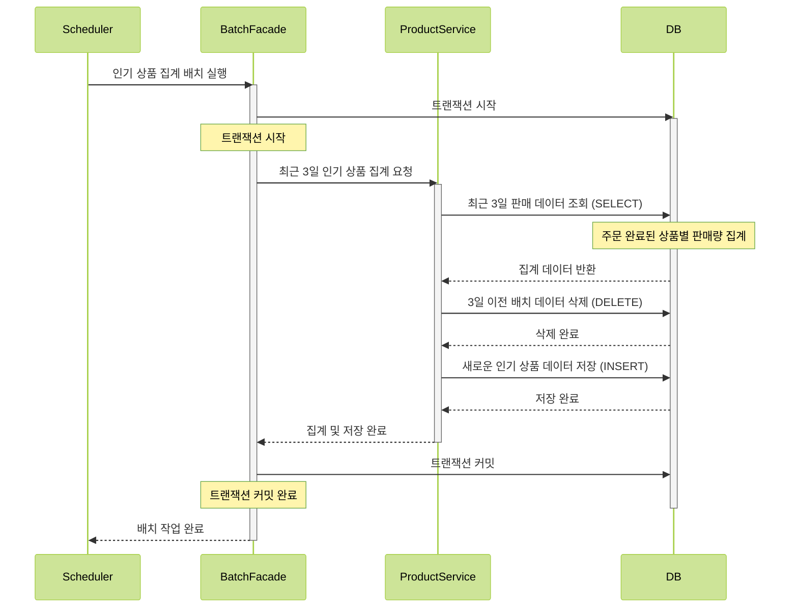
```mermaid
---
config:
  theme: forest
---
sequenceDiagram
    participant Scheduler
    participant BatchFacade
    participant ProductService
    participant DB

    %% 배치 작업 시작 (매일 자정)
    Scheduler->>BatchFacade: 인기 상품 집계 배치 실행
    activate BatchFacade
    
    %% 트랜잭션 시작
    BatchFacade->>DB: 트랜잭션 시작
    activate DB
    Note over BatchFacade: 트랜잭션 시작
    
    %% 최근 3일 판매 데이터 집계
    BatchFacade->>ProductService: 최근 3일 인기 상품 집계 요청
    activate ProductService
    
    ProductService->>DB: 최근 3일 판매 데이터 조회 (SELECT)
    Note over DB: 주문 완료된 상품별 판매량 집계
    DB-->>ProductService: 집계 데이터 반환
    
    %% 기존 배치 데이터 삭제
    ProductService->>DB: 3일 이전 배치 데이터 삭제 (DELETE)
    DB-->>ProductService: 삭제 완료
    
    %% 새로운 배치 데이터 저장
    ProductService->>DB: 새로운 인기 상품 데이터 저장 (INSERT)
    DB-->>ProductService: 저장 완료
    
    ProductService-->>BatchFacade: 집계 및 저장 완료
    deactivate ProductService
    
    %% 트랜잭션 커밋
    BatchFacade->>DB: 트랜잭션 커밋
    Note over BatchFacade: 트랜잭션 커밋 완료
    deactivate DB
    
    BatchFacade-->>Scheduler: 배치 작업 완료
    deactivate BatchFacade
```
---
### 최근 3일 판매 상위 5개 데이터 조회
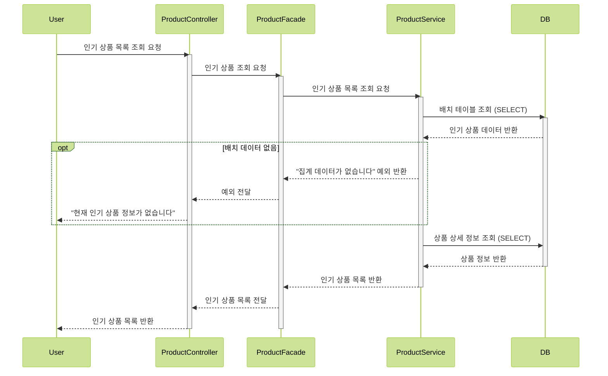
```mermaid
---
config:
  theme: forest
---
sequenceDiagram
    participant User
    participant ProductController
    participant ProductFacade
    participant ProductService
    participant DB

    User->>ProductController: 인기 상품 목록 조회 요청
    activate ProductController
    ProductController->>ProductFacade: 인기 상품 조회 요청
    activate ProductFacade
    
    %% 인기 상품 조회
    ProductFacade->>ProductService: 인기 상품 목록 조회 요청
    activate ProductService
    
    %% 배치 데이터 조회
    ProductService->>DB: 배치 테이블 조회 (SELECT)
    activate DB
    DB-->>ProductService: 인기 상품 데이터 반환
    
    opt 배치 데이터 없음
        ProductService-->>ProductFacade: "집계 데이터가 없습니다" 예외 반환
        ProductFacade-->>ProductController: 예외 전달
        ProductController-->>User: "현재 인기 상품 정보가 없습니다"
    end
    
    %% 상품 상세 정보 조회
    ProductService->>DB: 상품 상세 정보 조회 (SELECT)
    DB-->>ProductService: 상품 정보 반환
    deactivate DB
    
    ProductService-->>ProductFacade: 인기 상품 목록 반환
    deactivate ProductService
    
    ProductFacade-->>ProductController: 인기 상품 목록 전달
    ProductController-->>User: 인기 상품 목록 반환
    deactivate ProductFacade
    deactivate ProductController
```