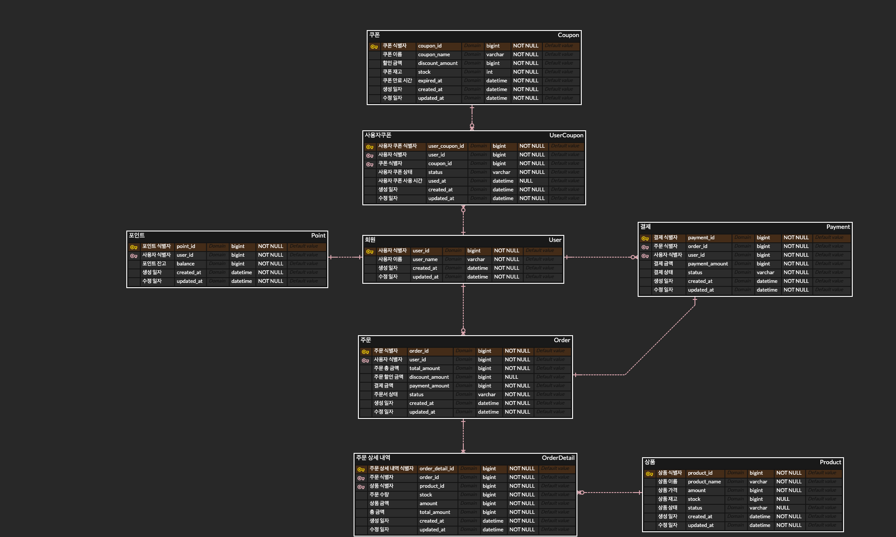

## e-커머스 프로젝트 ERD

---

---

## 테이블 명세서 
### USER (사용자)
- 목적: 서비스를 이용하는 사용자의 기본 정보 관리
- 주요 필드:
  - `userId` : 사용자 고유 식별자
  - `userName` : 사용자 이름

---
### POINT (포인트)
- 목적: 사용자의 포인트 잔액 및 이력 관리
- 주요 필드:
  - `pointId` : 포인트 고유 식별자
  - `userId` : 사용자 식별자
  - `balance` : 포인트 잔액

---
### PRODUCT (상품)
- 목적: 판매 상품 정보 관리
- 주요 필드: 
  - `productId` : 상품 고유 식별자
  - `productName` : 상품명
  - `amount` : 상품 가격
  - `stock` : 재고 수량
  - `status` : 상품 상태(AVAILABLE, SOLD_OUT)

---

### POPULAR_PRODUCT (인기 상품)
- 목적: 상품의 판매 통계 및 인기 상품 관리
- 주요 필드:
  - `popularProductId` : 인기 상품 고유 식별자
  - `productId` : 상품 식별자
  - `salesCount` : 판매 수량
  
---

### COUPON (쿠폰)
- 목적: 할인 쿠폰 정보 관리
- 주요 필드: 
  - `couponId` : 쿠폰 고유 식별자
  - `couponName` : 쿠폰명
  - `discountAmount` : 할인 금액
  - `stock` : 쿠폰 수량
  - `expiredAt` : 만료 일시
  - `status` : 쿠폰 상태(AVAILABLE,UNAVAILABLE)

---

### USER_COUPON (사용자 쿠폰)
- 목적: 사용자별 보유 쿠폰 관리
- 주요 필드:
  - `userCouponId` : 사용자 쿠폰 고유 식별자
  - `userId` : 사용자 식별자
  - `couponId` : 쿠폰 식별자
  - `status` : 쿠폰 상태(AVAILABLE,UNAVAILABLE)
  - `usedAt` : 사용 일시

---

### ORDER (주문)
- 목적: 주문 정보 관리
- 주요 필드:
  - `orderId` : 주문 고유 식별자
  - `userId` : 사용자 고유 식별자
  - `totalAmount` : 총 주문 금액
  - `discountAmount` : 할인 금액
  - `paymentAmount` : 결제 금액
  - `status` : 주문 상태

---

### ORDER_DETAIL(주문 상세)
- 목적: 주문별 상품 상세 정보 관리
- 주요 필드:
  - `orderDetaild` : 주문 상세 고유 식별자
  - `orderId` : 주문 식별자
  - `productId` : 상품 식별자
  - `stock` : 주문 수량
  - `amount` : 상품 금액
  - `totalAmount` : 총 금액

---

### PAYMENT (결제)
- 목적: 주문에 대한 결제 정보 관리
- 주요 필드:
  - `paymentId` : 결제 고유 식별자
  - `orderId` : 주문 식별자
  - `userId` : 사용자 식별자
  - `paymentAmount` : 결제 금액
  - `status` : 결제 상태

---

### DATA_PLATFORM_LOG (결제 데이터 저장소)
- 목적: 결제 완료된 데이터 로깅 
- 주요 필드: 
  - `id` : 로그 고유 식별자
  - `orderId` : 주문 식별자
  - `paymentId` : 결제 식별자
  - `orderDetail` : 주문 상세 정보
  - `paymentDetail` : 결제 상세 정보
  - `discountDetail` : 할인 상세 정보
- 특이 사항:
  - `orderDetail` , `paymentDetail`, `discountDetail` 데이터는 JSON 형태로 변환하여 저장한다.